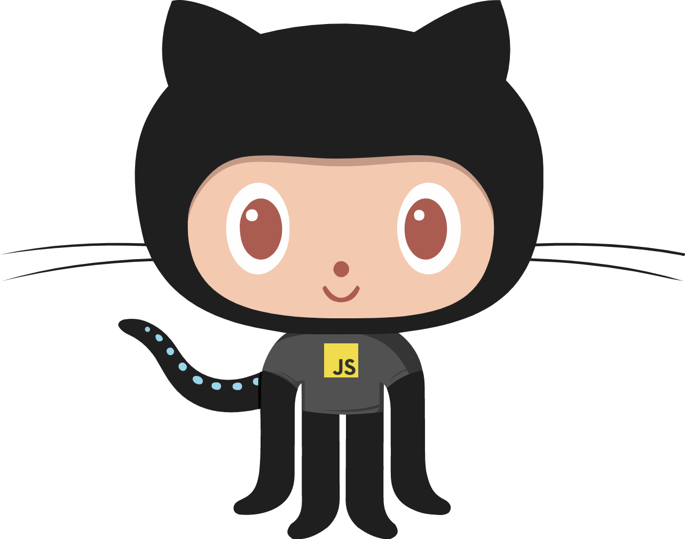

| ⚡ Stats ⚡ | 🔥 Streak 🔥 |
| :-: | :-: |
|  |  |

### Recent Blog Posts &nbsp;📜

<!-- BLOG-POST-LIST:START -->

- [Animated characters brought to life](https://arndom.hashnode.dev/animated-characters-brought-to-life)
- [Pull up socials and more from a single email: Kelvin Data API Introduction](https://arndom.hashnode.dev/pull-up-socials-and-more-from-a-single-email-kelvin-data-api-introduction)
- [Simple HOC in React](https://arndom.hashnode.dev/simple-hoc-in-react)

<!-- BLOG-POST-LIST:END -->

### My links &nbsp;🌍

  
<b>✨  More From Me</b>

### Ongoing Side Projects &nbsp;💻

- [NFTinder](https://women.artwork.rocks/)
- [Real Characters (P.O.C)](https://animatd.netlify.app/)

### Bored Builds &nbsp;🛠

- [Password Generator](https://generat8password.netlify.app/)
- [MakerFlow](https://maker-flow.web.app/)

